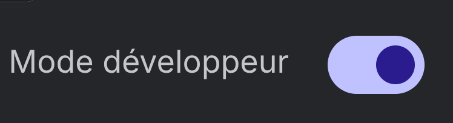
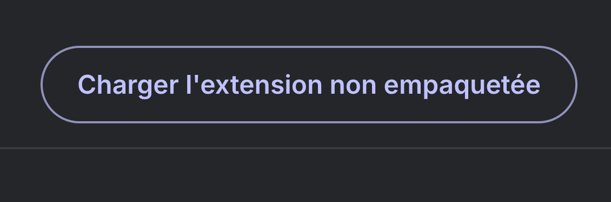

<div align="center">
  
  <h1>CheckMate</h1>
  <p><strong>Extension Chrome qui automatise le pointage de présence sur CESAR Emineo.<br>Un clic suffit - connexion, signature et validation sont faites pour vous.</strong></p>


</div>

---

## Sommaire

- [Présentation](#présentation)
- [Fonctionnalités](#fonctionnalités)
- [Installation](#installation)
- [Configuration](#configuration)
- [Utilisation](#utilisation)
- [Mises à jour](#mises-à-jour)
- [Confidentialité](#confidentialité)
- [Compatibilité](#compatibilité)

---

## Présentation

CheckMate est une extension Chrome conçue pour les apprenants et formateurs utilisant la plateforme **CESAR Emineo**. Elle automatise entièrement le processus de pointage : ouverture de la session, connexion, recherche du bouton de signature, reproduction fidèle de votre signature manuscrite et validation.

> Une fois configurée, il suffit d'un seul clic pour pointer sa présence.

---

## Fonctionnalités

| Fonctionnalité            | Détail                                                                                                           |
| ------------------------- | ---------------------------------------------------------------------------------------------------------------- |
| **Connexion automatique** | Se connecte avec vos identifiants si la session est expirée. Détecte automatiquement si vous êtes déjà connecté. |
| **Signature automatique** | Rejoue votre signature manuscrite sur le canvas du site, avec centrage et mise à l'échelle automatiques.         |
| **Journal d'exécution**   | Chaque étape est horodatée et affichée dans le popup pour faciliter le diagnostic.                               |

---

## Installation

> CheckMate n'est pas _encore_ disponible sur le Chrome Web Store. L'installation se fait manuellement en mode développeur, la procédure prend moins d'une minute.

### Étape 1 - Télécharger l'extension

Rendez-vous sur la [page des releases](https://github.com/MattiaPARRINELLO/CheckMate/releases/latest) et téléchargez le fichier **`CheckMate.zip`**, puis décompressez-le dans un dossier de votre choix.

> 💡 Ne supprimez pas ce dossier après l'installation - Chrome en a besoin pour charger l'extension.

<!-- SCREEN : Page des releases GitHub avec le bouton de téléchargement du ZIP -->

---

### Étape 2 - Ouvrir la page des extensions Chrome

Dans la barre d'adresse de Chrome, saisissez :

```
chrome://extensions/
```

---

### Étape 3 - Activer le mode développeur

En haut à droite de la page, activez le **Mode développeur**.



<!-- SCREEN : Interrupteur "Mode développeur" activé en haut à droite -->

---

### Étape 4 - Charger l'extension

Cliquez sur **« Charger l'extension non empaquetée »** (ou _Load unpacked_), puis sélectionnez le dossier décompressé à l'étape 1.



<!-- SCREEN : Bouton "Charger l'extension non empaquetée" + sélecteur de dossier -->

---

### Étape 5 - Vérifier l'installation

CheckMate apparaît dans la liste des extensions avec son logo. Épinglez-la dans la barre d'outils Chrome pour y accéder facilement.

---

## Configuration

Avant le premier pointage, vous devez configurer vos identifiants et votre signature. Cliquez sur l'icône CheckMate dans la barre d'outils pour ouvrir le popup.

### 1. Dérouler le panneau de configuration

Cliquez sur **« Configuration »** en bas du popup pour afficher les champs.

---

### 2. Saisir vos identifiants CESAR

Renseignez votre **identifiant** et votre **mot de passe** CESAR dans les champs prévus.

> Vos identifiants sont stockés localement dans `chrome.storage.local`, uniquement sur votre machine. Ils ne sont jamais envoyés à un serveur tiers.

---

### 3. Dessiner votre signature

Dans la zone de dessin, tracez votre **signature manuscrite** à la souris ou au stylet. Cette signature sera reproduite automatiquement sur le canvas CESAR à chaque pointage.

- Cliquez sur **« Effacer »** pour recommencer.
- La signature est mise à l'échelle et centrée automatiquement - inutile de la faire exactement à la même taille que sur le site.

---

### 4. Sauvegarder

Cliquez sur **« Sauvegarder »**. Le statut passe à **« Configuré »** et le bouton principal devient actif.

---

## Utilisation

Une fois configurée, l'utilisation se résume à **un seul clic**.

1. Cliquez sur l'icône CheckMate dans la barre d'outils.
2. Cliquez sur **« Pointer ma présence »**.
3. Un onglet CESAR s'ouvre. L'extension gère toutes les étapes automatiquement.
4. Une notification Chrome vous informe du résultat.

### Suivi en temps réel

Le **journal d'exécution** dans le popup affiche chaque étape horodatée : ouverture de la page, connexion, recherche du bouton, replay de la signature, confirmation. En cas d'échec, le message d'erreur y apparaît pour faciliter le diagnostic.

---

## Mises à jour

CheckMate vérifie automatiquement sa version à chaque pointage en interrogeant les releases GitHub.

**Si votre extension est à jour** - rien ne se passe, la signature s'effectue normalement.

**Si une version plus récente est disponible** - une **fenêtre modale bloquante** s'affiche dans la page CESAR dès son ouverture, avant toute tentative de signature :

<!-- SCREEN : Modale "Confirmation requise avant signature" avec les 3 boutons -->

| Bouton                       | Action                                                        |
| ---------------------------- | ------------------------------------------------------------- |
| **Mettre à jour maintenant** | Ouvre la page de téléchargement de la nouvelle version        |
| **Continuer quand même**     | Ignore l'avertissement et lance la signature (non recommandé) |
| **Annuler la signature**     | Ferme l'onglet CESAR et arrête le processus                   |

> ⚠️ Utiliser une version obsolète peut provoquer des erreurs de signature ou un pointage invalide si le site CESAR a évolué.

### Comment mettre à jour

1. Téléchargez le nouveau ZIP depuis la [page des releases](https://github.com/MattiaPARRINELLO/CheckMate/releases/latest).
2. Remplacez le contenu du dossier existant par les nouveaux fichiers.
3. Dans `chrome://extensions/`, cliquez sur le bouton **↺ Recharger** sur la carte CheckMate.

> Vos identifiants et votre signature sont conservés dans `chrome.storage.local` - ils ne sont **pas** supprimés lors d'une mise à jour.

---

## Confidentialité

- **Identifiants** : stockés localement via `chrome.storage.local`, uniquement sur votre machine.
- **Signature** : stockée localement sous forme de coordonnées de tracé, uniquement sur votre machine.
- **Aucune donnée** n'est transmise à un serveur externe. La seule requête réseau initiée par l'extension (hors navigation CESAR) est un appel en lecture seule à l'API publique GitHub pour vérifier la dernière version disponible.

---

## Compatibilité

| Navigateur             | Support                      | Moteur   |
| ---------------------- | ---------------------------- | -------- |
| Google Chrome          | ✅ Supporté                  | Chromium |
| Microsoft Edge         | ✅ Compatible                | Chromium |
| Brave                  | ✅ Compatible                | Chromium |
| Opera / Opera GX       | ✅ Compatible                | Chromium |
| Vivaldi                | ✅ Compatible                | Chromium |
| Arc                    | ✅ Compatible                | Chromium |
| Yandex Browser         | ✅ Compatible                | Chromium |
| Kiwi Browser (Android) | ✅ Compatible                | Chromium |
| Firefox                | ⏳ Non supporté actuellement | Gecko    |
| Firefox pour Android   | ⏳ Non supporté actuellement | Gecko    |
| Safari                 | ❌ Non supporté              | WebKit   |
| Safari iOS             | ❌ Non supporté              | WebKit   |

> **Vous utilisez Firefox ou un autre navigateur non supporté ?**
> Une version compatible Firefox peut être développée si la demande est suffisante.
> [👉 Ouvrez une issue GitHub](https://github.com/MattiaPARRINELLO/CheckMate/issues/new?title=Support+Firefox&body=Je+souhaite+une+version+compatible+Firefox.) pour voter pour cette fonctionnalité ou demander le support d'un autre navigateur - plus il y a de demandes, plus la priorité est haute.

> ℹ️ Tous les navigateurs basés sur Chromium peuvent charger CheckMate de la même façon que Chrome, via le mode développeur (`chrome://extensions/` ou équivalent dans le navigateur concerné).

---

<div align="center">
  <sub>Fait avec ♟️ par <a href="https://github.com/MattiaPARRINELLO">MattiaPARRINELLO</a></sub>
</div>
